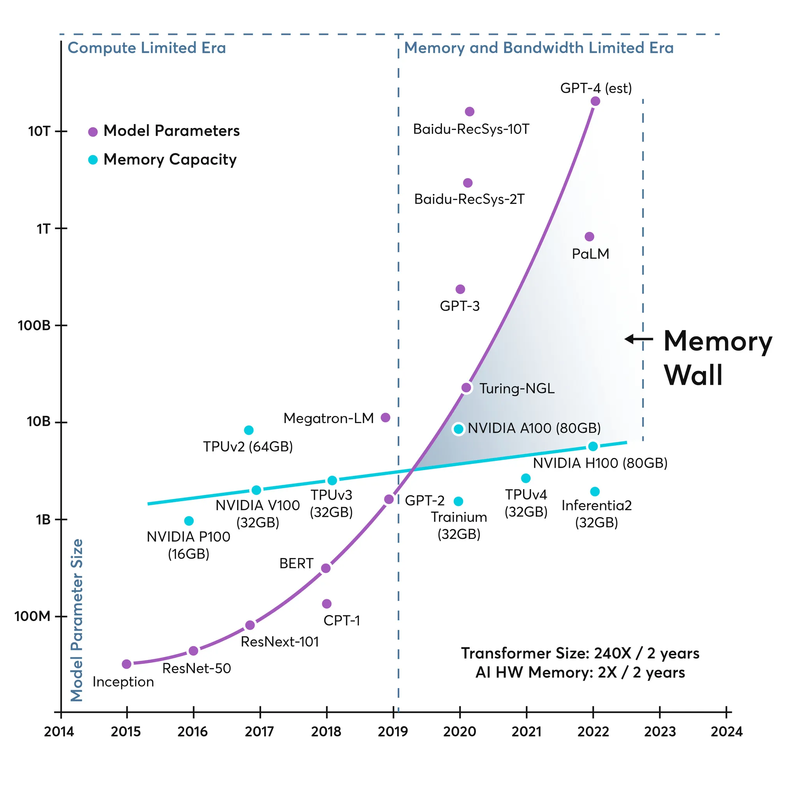
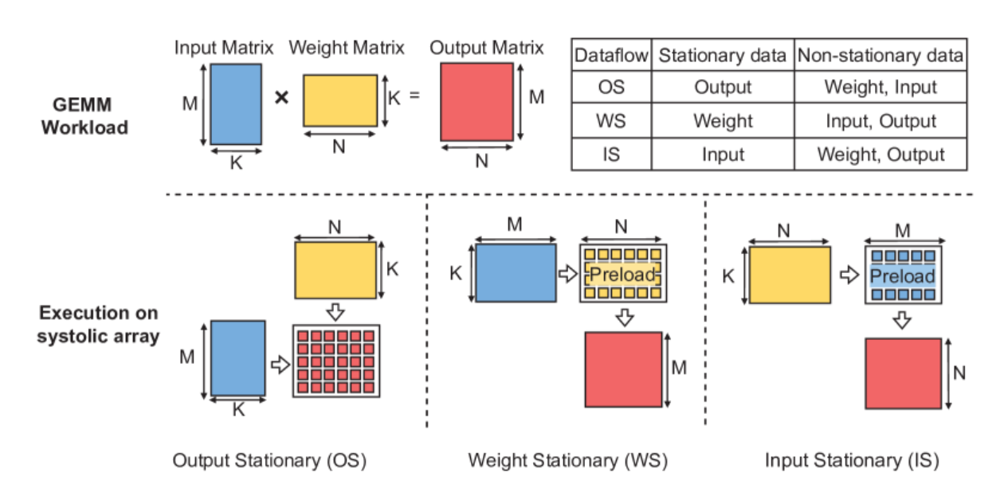
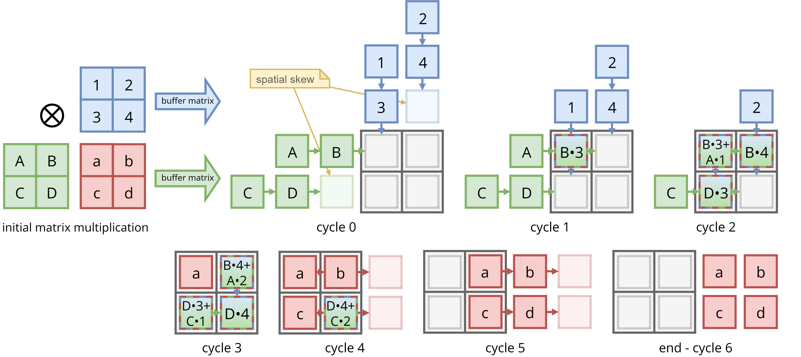

# Arranjo Sistólico (*Systolic Array*)

O principal desafio no projeto de NPUs não reside no custo computacional das operações aritméticas em si, mas no consumo energético e na latência associados à movimentação de dados entre os diferentes níveis da hierarquia de memória. Em muitos cenários, o gasto energético para acessar a memória - especialmente fora do chip - supera significativamente o custo de executar operações de multiplicação e acumulação. Essa limitação é conhecida como **Memory Wall**, fenômeno que descreve a crescente disparidade entre a capacidade de processamento dos sistemas e a largura de banda efetiva da memória. À medida que o desempenho computacional evolui em ritmo acelerado, a escalabilidade do subsistema de memória é restringida por limitações físicas e tecnológicas, como gargalos de entrada e saída (I/O) e desafios de integridade de sinal, tornando a movimentação de dados um fator dominante no consumo de energia e no tempo total de execução.

{ .hero-img }

Para vencer esse desafio, a arquitetura mais clássica e eficiente (usada no Google TPU - Tensor Processing Unit) é o **Arranjo Sistólico**. Imagine um “grid” de unidades de cálculo (PEs - *Processing Elements*). Em vez de cada PE ir buscar dados na memória principal, eles passam dados para o vizinho. É como uma linha de montagem: os dados fluem ritmicamente (daí o nome “sistólico”, como o batimento cardíaco) através da matriz. 

!!! tip "Redução de Acesso à Memória"
    Isso reduz drasticamente o acesso à memória, pois um dado lido uma vez reutilizado por vários PEs. Sendo de suma importância para não congestionar a tráfego de dados pelo barramento principal do SoC (*System-on-Chip*).

Existem algumas abordagens possíveis para o fluxo de dados (***dataflow***) em Arranjos Sistólico, sendo as mais comuns: 

- ***Weight Stationary*** (Pesos Estacionários): os pesos da rede neural são carregados nos PEs e ficam lá fixos. As entradas (ou ativações) fluem horizontalmente e as somas parciais fluem verticalmente (ou se acumulam localmente). Isso torna essa estratégia excelente para inferência e convoluções onde os mesmos filtros (pesos) são aplicados repetidamente sobre diferentes dados. Maximiza o reuso dos pesos. 

- ***Output Stationary*** (Saídas Estacionárias): o resultado da multiplicação (o acumulador) fica parado no PE. As entradas e os pesos fluem através do arranjo. Quando precisamos calcular somas muito grandes que não precisam sair do chip imediatamente, mas requer uma lógica de controle um pouco diferente. Útil para multiplicação de matrizes geral (**GEMM**).
    
- ***Input Sationary*** (Entradas Estacionárias): as ativações (dados de entrada) são carregadas nos PEs e permanecem fixas lá, enquanto os pesos e as somas parciais fluem através do arranjo de processamento. Essa estratégia é extremamente vantajosa quando uma mesma entrada precisa ser processada por diversos filtros diferentes (por exemplo, em camadas convolucionais com muitos canais de saída). O foco aqui é maximizar o reuso das entradas, minimizando o custo energético de buscar os mesmos dados repetidamente na memória principal.

- ***Hybrid Approaches*** (Abordagem Híbridas): combinam elementos das estratégias anteriores para equilibrar o fluxo de dados, adaptando-se de forma dinâmica ou arquitetural às dimensões específicas de cada camada da rede neural (tamanho do filtro, tamanho da imagem, número de canais). O objetivo principal é otimizar simultaneamente o reuso de pesos, entradas e saídas.

{ .hero-img }

Neste projeto, é adotado o fluxo de dados de tipo ***Output Stationary***. Dessa forma, as somas parciais (*partial sums*) são acumuladas localmente nos *Processing Elements* (PEs), levando a uma redução drástica na largura de banda necessária para escrever os resultados intermediários de volta na memória.

{ .hero-img }

Essa abordagem, entretanto, não pressupõe a existência de um número ilimitado de PEs capaz de processar toda a carga de dados simultaneamente. Na prática, o tamanho do array sistólico é limitado por restrições de área, consumo energético e complexidade de interconexão. Para acomodar matrizes de entrada maiores do que a capacidade física do array, o processamento é particionado no tempo, e o fluxo de dados é mediado por buffers FIFO (First-In, First-Out). Esses buffers atuam como um mecanismo de desacoplamento entre o subsistema de memória — potencialmente mais lento ou com latência variável — e o array sistólico, que requer um fornecimento contínuo e regular de dados para operar de forma eficiente. Dessa forma, os FIFOs funcionam como um “pulmão” do sistema, absorvendo variações de latência da memória e garantindo que o pipeline computacional do array sistólico permaneça plenamente ocupado.

Consequentemente, a arquitetura opta por **trocar paralelismo espacial por paralelismo temporal**, utilizando um conjunto finito de recursos de hardware ao longo de múltiplos ciclos de clock. Esse trade-off entre área de silício e tempo de execução é um princípio fundamental no projeto de sistemas digitais e está diretamente associado ao conceito de **multiplexação no tempo (*time multiplexing*)**. Quando não há área suficiente para instanciar unidades de processamento capazes de operar sobre todos os dados simultaneamente, os mesmos recursos são reutilizados sequencialmente, distribuindo a computação ao longo do tempo. Dessa forma, a limitação física de área é compensada por um aumento controlado na latência, permitindo implementar funcionalidades complexas com um custo de silício reduzido.

Como consequência direta da multiplexação no tempo, parte da computação originalmente paralela é serializada, sendo distribuída ao longo de múltiplos ciclos de clock. Essa serialização não decorre de limitações algorítmicas, mas de uma decisão arquitetural motivada por restrições de área e consumo energético. Em arrays sistólicos de NPUs, essa abordagem se materializa na divisão da carga de trabalho em blocos menores (***tiling***), processados sequencialmente pelo mesmo conjunto de processing elements (PEs). Assim, a reutilização temporal dos recursos físicos permite executar operações de grande porte com um array de dimensão finita, à custa de um aumento controlado na latência total, preservando eficiência energética e simplicidade de interconexão.

Como os resultados tornam-se disponíveis de forma **parcial a cada ciclo de clock**, é necessário acumular essas contribuições ao longo do tempo. Para isso, combina-se um **somador** com um **registrador**, permitindo que os valores intermediários sejam acumulados sequencialmente. Em FPGAs, essa estrutura é tipicamente implementada utilizando **blocos dedicados de DSP (Digital Signal Processing)** — unidades de hardware especializadas em operações aritméticas intensivas, como multiplicação, soma e acumulação, com alta eficiência energética e temporal. A partir desses blocos, constrói-se a **MAC Unit (*Multiply–Accumulate*)**, composta por um **multiplicador**, seguido por um **somador** e um **registrador de acumulação**, capaz de executar operações do tipo:

$$
\text{Resultado}=(\text{Peso}\times \text{Entrada})+\text{Acumulador}
$$ 

Essa unidade deve também ser capaz de receber um sinal de reset, responsável por reinicializar o valor do registrador de acumulação, além de realizar a extração do resultado acumulado em cada PE (através do sinal de `acc_dump`). Dessa forma, ao término do processamento de um conjunto de dados previamente definido, o sistema retorna a um estado inicial bem definido, permitindo o início de uma nova computação sem interferência de resultados anteriores.

## Referências

- JOUPPI, Norman P. et al. In-datacenter performance analysis of a tensor processing unit. In: Proceedings of the 44th annual international symposium on computer architecture. 2017. p. 1-12.
- SASASATORI. Revisão do projeto de arquitetura de arrays sistólicos. Disponível em: <https://www.cnblogs.com/sasasatori/p/19038607>. Acesso em: 26 mar. 2026.
- XU, Rui et al. Heterogeneous systolic array architecture for compact CNNs hardware accelerators. IEEE Transactions on Parallel and Distributed Systems, v. 33, n. 11, p. 2860-2871, 2021.
- STAFF. What is the memory wall in computing? Disponível em: <https://ayarlabs.com/glossary/memory-wall/>.
- HENNESSY, John L.; PATTERSON, David A. Computer architecture: a quantitative approach. Elsevier, 2011.